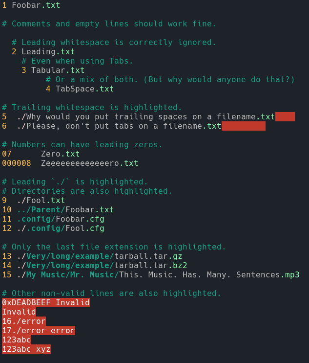

# edir Color Highlighting for Vim

[edir](https://github.com/bulletmark/edir) color highlighting for vim to easily recognize directory and file extensions.

## Screenshot



## Installation

The recommended way to install it is by using one of the several Vim plugin managers:

* [Vim-Plug](https://github.com/junegunn/vim-plug): `Plug 'denilsonsa/vim-edir-syntax'`
* [Vundle](https://github.com/VundleVim/Vundle.vim): `Plugin 'denilsonsa/vim-edir-syntax'`
* [NeoBundle](https://github.com/Shougo/neobundle.vim): `NeoBundle 'denilsonsa/vim-edir-syntax'`

Please remember to run edir with suffix `.edir`

```console
$ edir --suffix .edir
```

You can also [set it as a default extension](https://github.com/bulletmark/edir?tab=readme-ov-file#command-default-options) in `~/.config/edir-flags.conf`. See also [this suggestion in issue 21](https://github.com/bulletmark/edir/issues/21).
